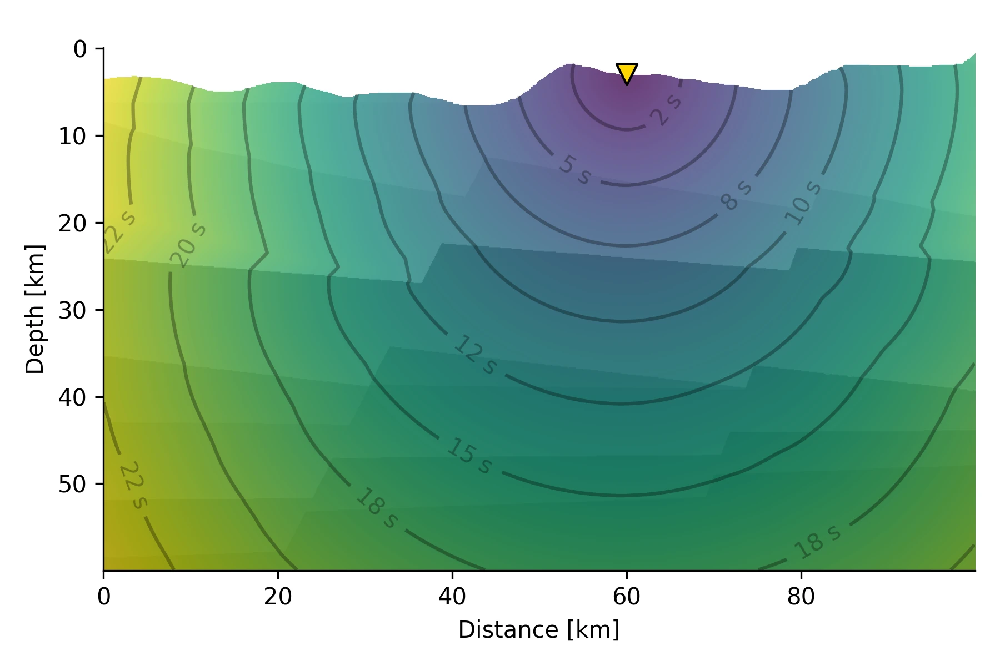

# Ray Tracers

The calculation of seismic travel times is a cornerstone for the migration and stacking approach. Lassie supports different ray tracers for travel time calculation, which can be adapted for different geological settings.

## Constant Velocity

The constant velocity models is trivial and follows:

$$
t_{P} = \frac{d}{v_P}
$$

This module is used for simple use cases and cross-referencing testing.

```python exec='on'
from lassie.utils import generate_docs
from lassie.tracers.constant_velocity import ConstantVelocityTracer

print(generate_docs(ConstantVelocityTracer()))
```

## 1D Layered Model

Calculation of travel times in 1D layered media is based on the [Pyrocko Cake](https://pyrocko.org/docs/current/apps/cake/manual.html#command-line-examples) ray tracer.


*Pyrocko Cake 1D ray tracer for travel time calculation in 1D layered media*

```python exec='on'
from lassie.utils import generate_docs
from lassie.tracers.cake import CakeTracer

print(generate_docs(CakeTracer(), exclude={'earthmodel': {'raw_file_data'}}))
```

## 3D Fast Marching

We implement the fast marching method for calculating first arrivals of waves in 3D volumes. Currently three different 3D velocity models are supported:

* [x] Import [NonLinLoc](http://alomax.free.fr/nlloc/) 3D velocity model
* [x] 1D layered model 🥞
* [x] Constant velocity, mainly for testing purposes 🥼


*Conceptual 2D visualisation for seismic traveltimes calculation in heterogenous media using the fast-marching method for the Eikonal solution is presented. Traveltimes from the receiving station at the surface (indicated by a yellow triangle) towards the subsurface grid are calculated, resulting in station-specifig traveltimes for all potential source locations simultaneously.*

```python exec='on'
from lassie.utils import generate_docs
from lassie.tracers.fast_marching import FastMarchingTracer

print(generate_docs(FastMarchingTracer()))
```

### Visualizing 3D Models

For quality check, all 3D velocity models are exported to `vtk/` folder as `.vti` files. Use [ParaView](https://www.paraview.org/) to inspect and explore the velocity models.


*Seismic velocity model of the Utah FORGE testbed site, visualized in ParaView.*
